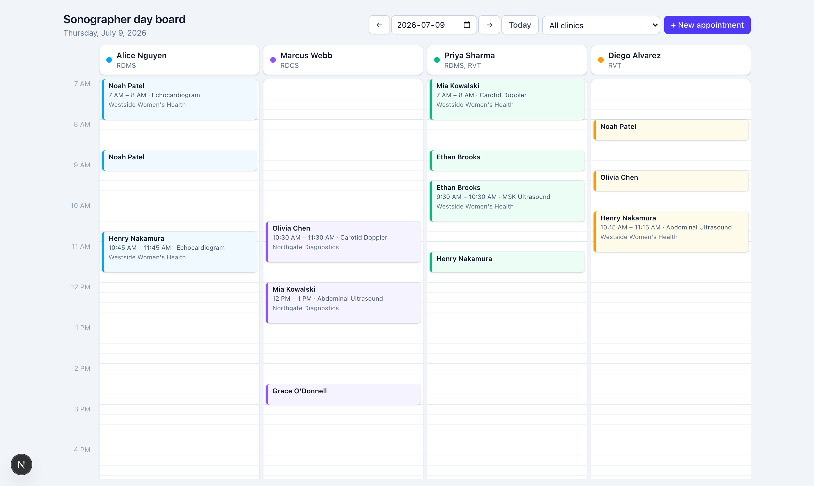
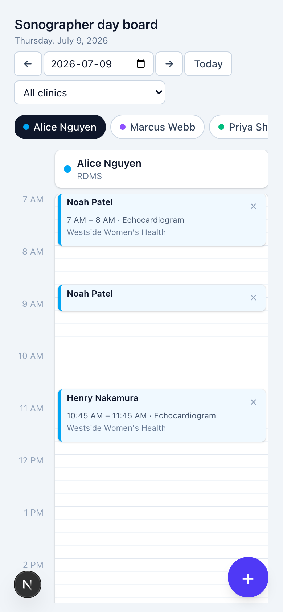
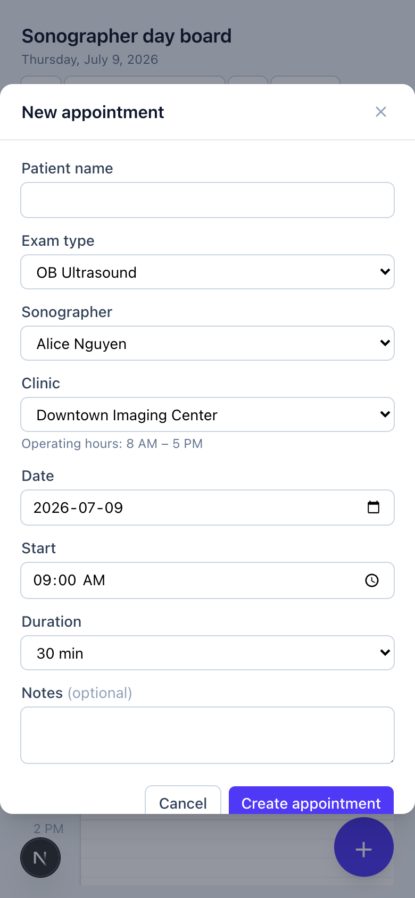

# Clinic Scheduling

A daily scheduling board for sonographers and clinics, built as a technical assessment.

**Live demo:** https://clinic-scheduling.mauricio-martinez.com


<p align="center">
  
</p>
<p align="center">
  
  &nbsp;&nbsp;
  
</p>

## Features

- **Day board** — one column per sonographer, 7 AM–7 PM in 15-minute slots, color-coded per sonographer.
- **Full CRUD** — create (click any empty slot or the "New appointment" button), edit (click a card), delete (card hover button or from the edit dialog).
- **Move by drag & drop** — drag a card to another time or sonographer; duration is preserved.
- **Double-booking prevention** — overlapping bookings for the same sonographer are rejected in the UI *and* by the mock API (HTTP 409). Back-to-back bookings are allowed.
- **Clinic operating hours** — appointments must fit inside the clinic's hours (HTTP 422 otherwise). Filtering by clinic shades its closed hours and dims other clinics' appointments.
- **Optimistic UI** — moves, edits, and deletes apply instantly and roll back with an error toast if the server rejects them.
- **Loading & error states** — skeleton board while loading, retryable error panel on failure.
- **Responsive** — desktop shows all sonographers side by side with a sticky time gutter and headers; mobile shows one sonographer at a time with a tab switcher, long-press drag, and a floating create button.

## Stack

| Layer | Choice |
|---|---|
| Framework | Next.js 15 (App Router) + React 19 + TypeScript (strict) |
| Styling | Tailwind CSS 4 |
| Server state | TanStack Query 5 (caching, optimistic updates) |
| UI state | Zustand |
| Drag & drop | dnd-kit |
| Mock REST API | Mock Service Worker (MSW) |
| Tests | Vitest + Testing Library |
| Monorepo | pnpm workspaces + Turborepo |

See [docs/ARCHITECTURE.md](docs/ARCHITECTURE.md) for the reasoning and tradeoffs behind these choices.

## Repository layout

```
apps/
  web/                 Next.js app (UI, data fetching, mock API wiring)
packages/
  domain/              Pure scheduling domain: types, time math, validation rules.
                       No framework dependencies; shared by the UI and the mock API.
```

## Getting started

Requires Node ≥ 20 and pnpm (`corepack enable pnpm`).

```bash
pnpm install
pnpm dev        # http://localhost:3000
```

Other commands (run from the repo root, orchestrated by Turborepo):

```bash
pnpm test       # unit + integration tests (35 tests)
pnpm lint
pnpm typecheck
pnpm build
```

### Demo tips

- Append **`?simulateErrors`** to the URL to make the appointments request fail intermittently — this exercises the retryable error panel and the toast/rollback path on purpose. It's off by default so a normal review session never hits artificial failures.
- Data is seeded deterministically per date (same date → same schedule) and lives in the browser session; reload to reset your edits.

### Docker

```bash
docker compose up                          # containerized dev server on :3000
docker build -t clinic-scheduling . && \
  docker run -p 3000:3000 clinic-scheduling  # production image (standalone Next.js)
```

## Testing philosophy

- **Domain rules get the deepest coverage** (`packages/domain`): overlap boundaries, back-to-back bookings, self-exclusion when editing, operating-hour edges. These are the rules that matter clinically, and they're pure functions, so tests are fast and exhaustive.
- **Integration over mocks** (`apps/web/src/lib/__tests__`): the API client is tested against the real MSW handlers — the same code path the browser uses — asserting on status codes (409/422/404) and error payloads.
- **Component tests** cover the appointment form's validation UX (conflict and hours errors surface as accessible alerts, submission is blocked).

## Accessibility

- Native `<dialog>` for modals: focus trap, Escape, and inert background for free.
- Every form control has a real `<label>`; validation errors render in a `role="alert"` region; toasts announce via `aria-live`.
- Drag & drop is pointer-only by design; the equivalent keyboard path is opening a card (Enter/Space) and changing time/sonographer in the edit dialog.
- Empty slots are buttons with descriptive labels ("New appointment for Alice Nguyen at 9 AM").
